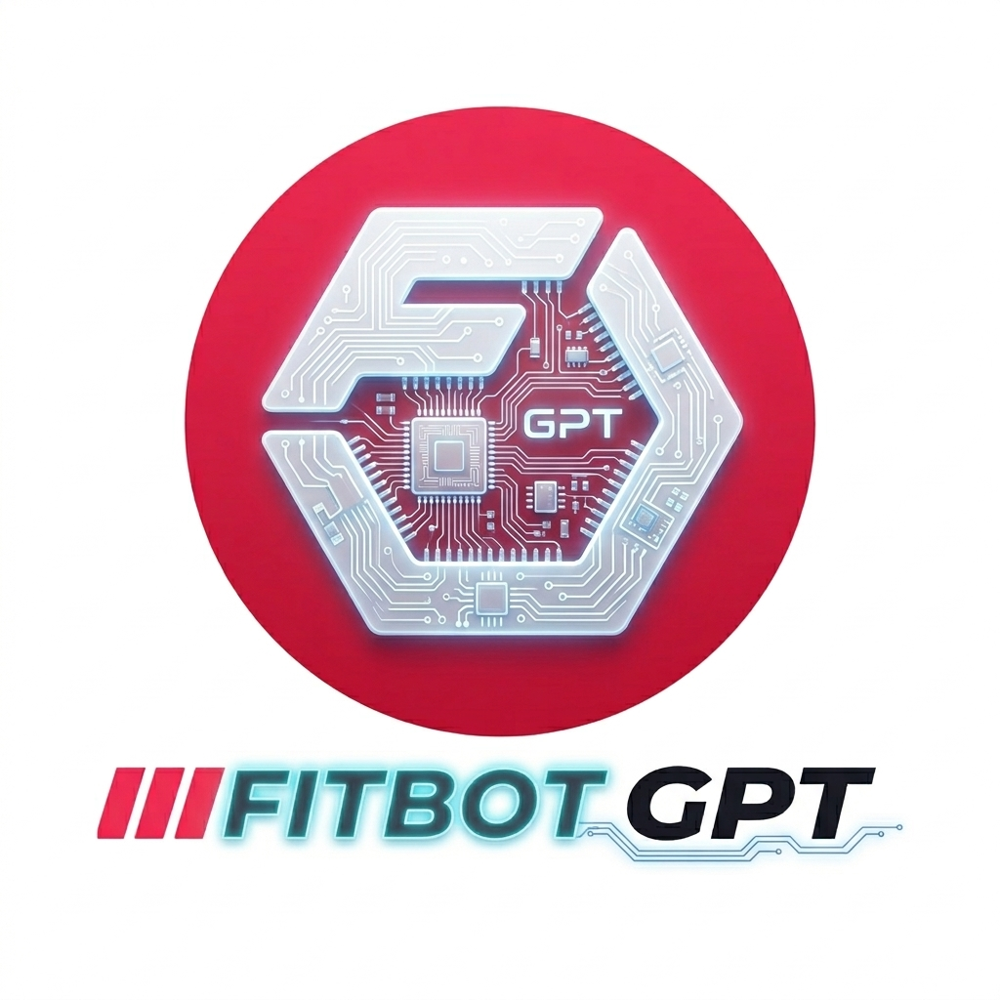

<p align="center">
  
</p>

# FitbodGPT

A custom GPT inside ChatGPT that analyzes your Fitbod workout data and provides personalized training analysis, imbalance detection, and science-backed workout plans.

## How It Works

```
Fitbod App → Export CSV → fitbod-report → GPT-optimized report → FitbodGPT → Personalized workout plan
```

1. Export your workout data from the Fitbod app (Log tab > settings > Export Workout Data)
2. Go to the [Fitbod Report app](https://fitbod-report.streamlit.app/), upload your CSV, pick a date range, and select "GPT" format
3. Copy the report using the copy button or download it
4. Open [FitbodGPT in ChatGPT](https://chatgpt.com/g/g-69bfd1becff08191b3b93c1d0312fda9-fitbodgpt) and paste or upload the report
5. Get personalized analysis and workout recommendations

The GPT export format stays weekly for consistent coaching. Source code for the report app: [fitbod-report on GitHub](https://github.com/rhnfzl/fitbod-report).

## Features

- **Multi-format input**: Accepts GPT, JSON, YAML, and Markdown reports
- **Adaptive coaching**: Detects your experience level (beginner/intermediate/advanced) from your data
- **Imbalance detection**: Identifies muscle group imbalances and suggests corrections
- **Smart equipment inference**: Determines your available equipment from exercise history
- **Structured workout plans**: Generates actionable plans with sets, reps, and weight guidance
- **Strength trends**: Tracks progression and identifies plateaus
- **209 exercise database**: Comprehensive exercise classification with muscle groups and equipment

## Repository Structure

```
fitbod-gpt/
├── spec/SPEC.md                    # Full specification
├── gpt/
│   ├── instructions.md             # GPT system prompt
│   ├── conversation-starters.md    # Conversation starter definitions
│   └── configuration.md            # GPT builder setup guide
├── knowledge/
│   ├── exercise-database.json      # Exercise classifications
│   ├── training-principles.md      # Training science reference
│   └── report-format-guide.md      # Report parsing guide
└── scripts/
    └── generate_exercise_db.py     # Exercise DB generator
```

## Setting Up the GPT

See [gpt/configuration.md](gpt/configuration.md) for step-by-step setup instructions.

## Publishing Checklist

- Add a profile image and confirm the GPT name/description shown on the About page
- Choose the most accurate category in the GPT builder
- Verify your Builder Profile before listing in the GPT Store
- Keep the GPT link-only until weekly export, paste flow, and upload flow all behave correctly
- Add a short training disclaimer to the About page before wider sharing

## Contributing Exercises

The exercise database covers 209 common Fitbod exercises but is not exhaustive. If you encounter exercises not in the database:

1. Run `python scripts/generate_exercise_db.py` to regenerate the base DB
2. Add new exercises to `knowledge/exercise-database.json`
3. Also update the corresponding `exercise_db.py` in the fitbod-report repo

The GPT will infer muscle groups for unknown exercises using its training knowledge, but adding them to the database improves accuracy.

## Related Projects

- [Fitbod Report](https://fitbod-report.streamlit.app/) - Web app to generate reports from Fitbod CSV exports ([GitHub](https://github.com/rhnfzl/fitbod-report))
- [FitbodGPT on ChatGPT](https://chatgpt.com/g/g-69bfd1becff08191b3b93c1d0312fda9-fitbodgpt) - The live GPT
- [Fitbod2HevyConverter](https://github.com/rhnfzl/Fitbod2HevyConverter) - Converts Fitbod data to Hevy format
- [hevy-gpt](https://github.com/hevyapp/hevy-gpt) - Inspiration: Hevy's custom GPT (has API integration)
